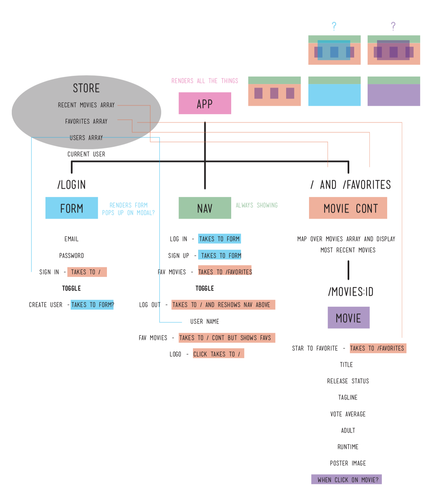
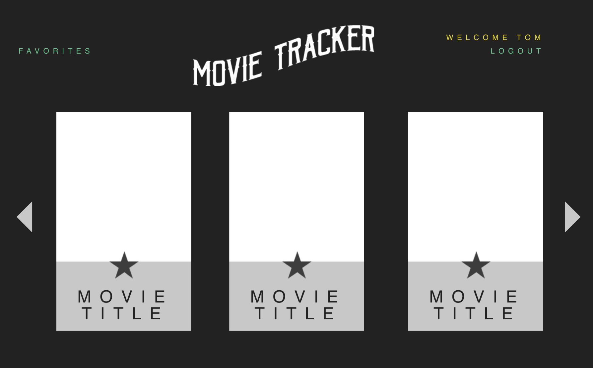
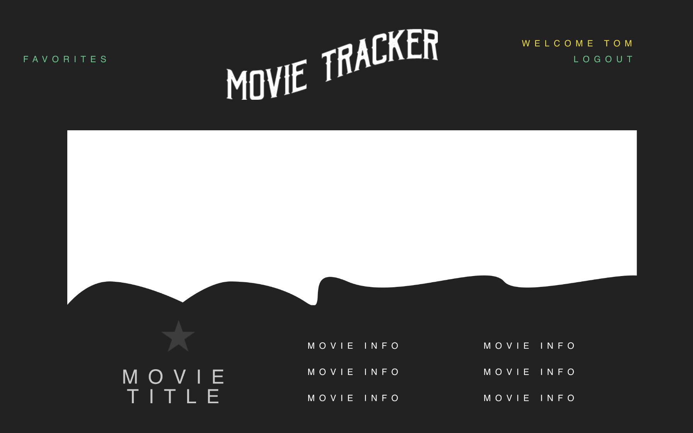

# Movie Tracker

Movie Tracker is a React-Redux App allows a user to sign in, see the latest movies, and favorite them for later.

### Focuses

- Write squeaky clean, well refactored code using ES6 syntax.

- Make informed design decisions to create a user-friendly application.

- Become comfortable with different network requests like GET, POST, & DELETE.

- Solidify concepts with React to create clean and re-useable components.

- Become comfortable with Redux’s lifecycle, creating actions, reducers, and connecting them to React components.

- Understand and solidify concepts with React component, asynchronous code, and Redux testing.

- Get more practice doing network requests with a backend.

### Screenshots
Data Map
- To begin, the overall data flow and necessary components are mapped out.



InVision Prototype
- Home Page: Next, a design is implemented and basic user flow is considered.





- Here is a clickable InVision Prototype: Click on a movies from the home screen then the main logo to get back.
https://projects.invisionapp.com/prototype/ck2c10pr0002ou501vi8y10og/play

Homepage/User Form
- User must input name, quote, and select a level before they can submit the form.


### Tech

- This project was bootstrapped with Create React App utilizing Redux.

- Tested with Jest/Enzyme.

- Links using React Router.

### Team

- Lacy Rudd (https://github.com/dawnlunacy)

- Jeannie Evans (https://github.com/jmevans0211)

- Quinne Farenwald (https://github.com/qfarenwald)

### Set Up

Clone repo.
```
git clone https://github.com/dawnlunacy/movie-tracker.git
```
Install dependencies.
```
npm install
```
Run browser.
```
npm start
```
