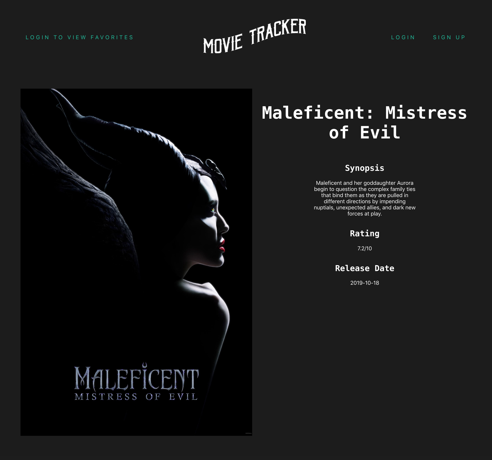
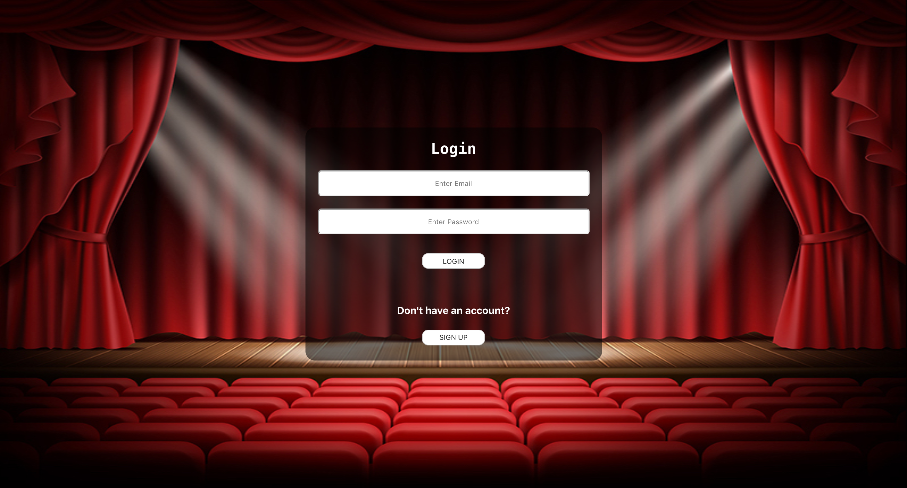
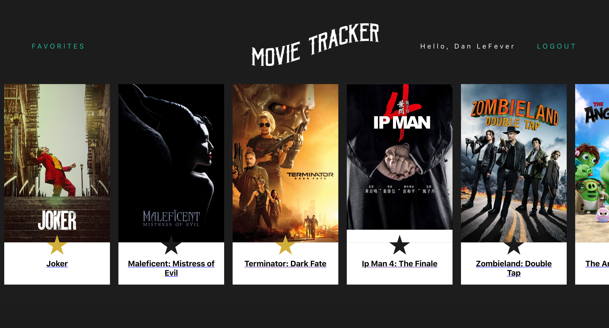
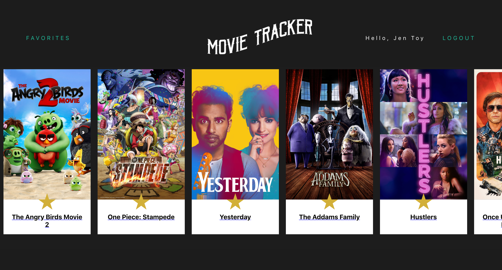

# Movie Tracker

Movie Tracker is a React-Redux App allows a user to sign in, see the latest movies, and favorite them for later.

### Focuses

- Write squeaky clean, well refactored code using ES6 syntax.

- Make informed design decisions to create a user-friendly application.

- Become comfortable with different network requests like GET, POST, & DELETE.

- Solidify concepts with React to create clean and re-useable components.

- Become comfortable with Redux’s lifecycle, creating actions, reducers, and connecting them to React components.

- Understand and solidify concepts with React component, asynchronous code, and Redux testing.

- Get more practice doing network requests with a backend.

### Screenshots
Data Map
- To begin, the overall data flow and necessary components are mapped out.


InVision Prototype
- Home Page: Next, a design is implemented and basic user flow is considered.


- Here is a clickable InVision Prototype: Click on a movies from the home screen then the main logo to get back.
https://projects.invisionapp.com/prototype/ck2c10pr0002ou501vi8y10og/play

Homepage
- A user can scroll through movies on the home page and click to view more detailed movie info by clicking on a movie, but if a user wants to favorite a movie, they will be prompted to login or sign up.




Sign Up Page
- A user can sign up to create an account that will allow favorites to be saved.


- If the user does not fill in all inputs, an error will appear and they will not be routed to their account homepage.


- If the user already had an account, they can login.



User Logged In Home Page
- Now a user is welcomed and the favoriting functionality is enabled.



Favorite Page
- A user can favorite movies by clicking on the star on each movie. Those movies will then appear on a separate favorites page.



- A user can logout at any time and be returned to the main homepage.


### Tech

- This project was bootstrapped with Create React App utilizing Redux.

- Tested with Jest/Enzyme.

- Links using React Router.

### Team

- Lacy Rudd (https://github.com/dawnlunacy)

- Jeannie Evans (https://github.com/jmevans0211)

- Quinne Farenwald (https://github.com/qfarenwald)

### Set Up

Clone repo.
```
git clone https://github.com/qfarenwald/movie-tracker
```
Install dependencies.
```
npm install
```
Run browser.
```
npm start
```
